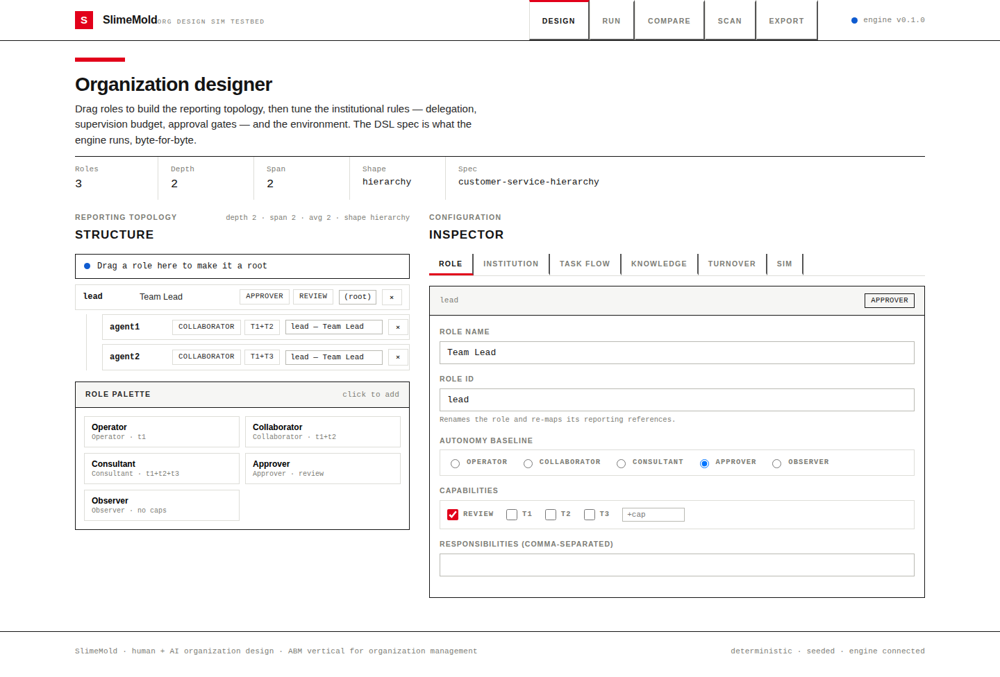
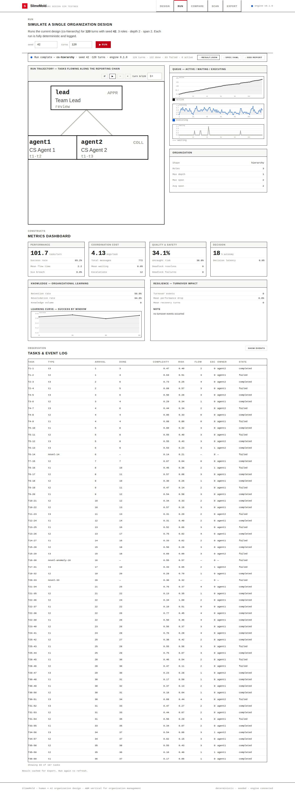
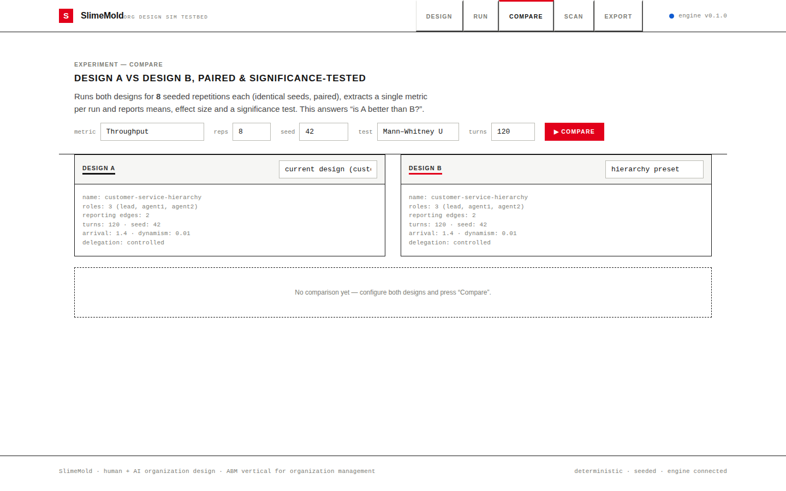
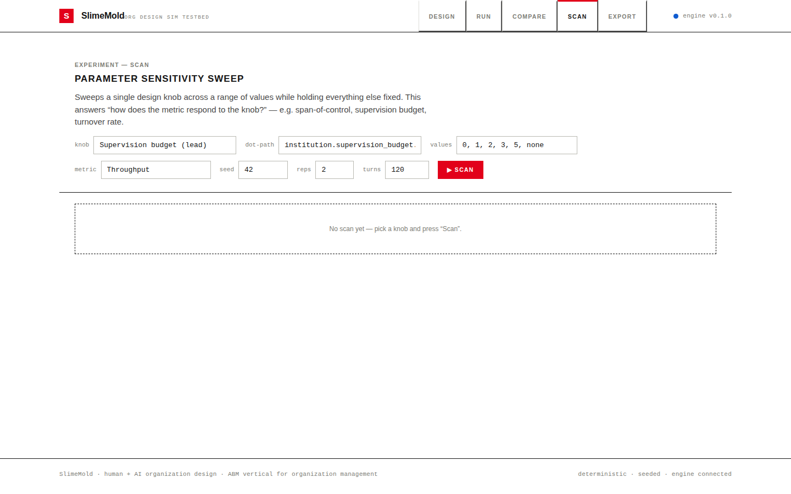
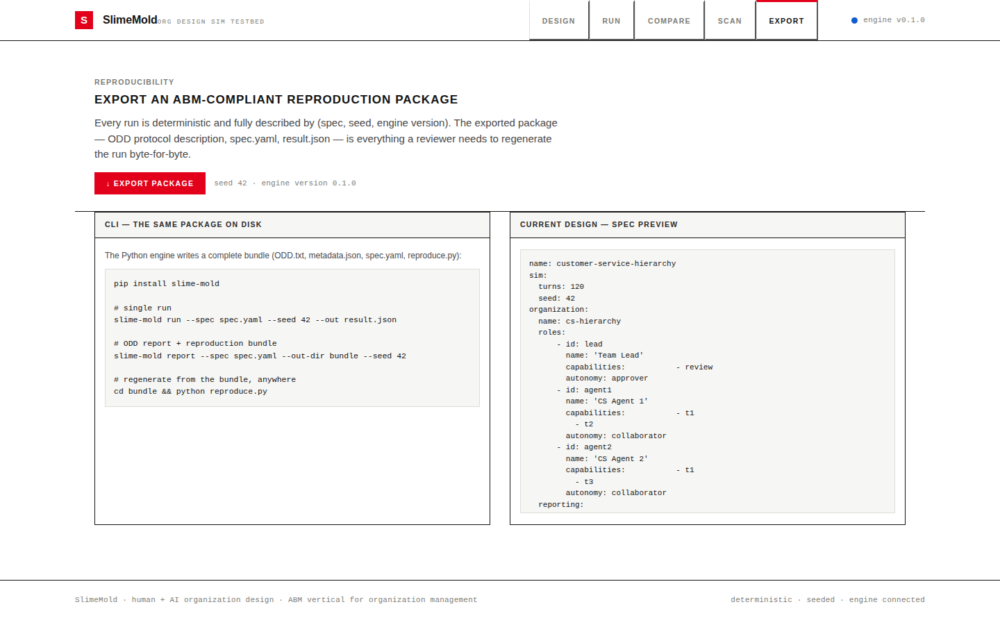

# SlimeMold

A deterministic agent-based testbed for **human + AI organization design**.
SlimeMold lets you specify an organization — roles, reporting lines,
institutions (delegation, approval, supervision), knowledge mechanisms, and
task flow — then simulate how it performs, coordinates, decides, learns, and
recovers. It is built as a *management-theory instrument*, not a generic ABM:
the concepts map directly onto contingency theory, agency theory,
organizational learning, and coordination theory.

Zero runtime dependencies. Fully reproducible: the same spec + seed produces
bit-identical event logs and metrics on any machine.

---

## Why another organization simulator?

Most agent-based organizational models either (a) assume away institutions
(free-form multi-agent systems with no reporting structure, approval gates, or
supervision budgets) or (b) model single agents rather than *organizations*.
SlimeMold sits in the gap: it simulates the organization as a system of
**roles**, **reporting relationships**, and **institutions**, and treats the
"AI agent" question as a parameter (autonomy, delegation, supervision) rather
than a given.

It is deliberately distinct from AgentSociety-style models by focusing on the
**organization management vertical**: topology, authority, delegation,
knowledge crystallization, and turnover resilience — the levers an actual
manager can pull.

---

## Features

- **Organization DSL** (YAML/JSON/dict) describing:
  - `Organization` — roles + reporting lines; classifies hierarchy / flat /
    matrix by shape (`max_depth`, multi-manager detection); computes
    span-of-control and depth.
  - `OrgRole` — capabilities, autonomy baseline, experience.
  - `Institution` — delegation strategies, approval gates, supervision
    budgets, a 5-level autonomy model
    (operator / collaborator / consultant / approver / observer), escalation
    and deadlock timeouts.
  - `KnowledgeMechanism` — crystallization, sharing, half-life decay,
    revalidation.
  - `TaskFlow` — dispatch along the reporting chain, environmental dynamism,
    anomaly / novelty injection.
  - `Turnover` — probabilistic member exit/replacement with generation
    tracking.
- **Deterministic turn-based scheduler** — master seed with SHA-256-derived
  per-stream streams (`turnover`, `env`, `tasks`, `agents`, `outcome`,
  `knowledge`); message bus with timeouts and deadlock detection; full event
  log.
- **Scripted + LLM agent adapters** — `ScriptedPolicy` for reproducible
  baselines; `LLMAgentAdapter` for plugging in real model calls; both behind a
  single `AgentPolicy` interface.
- **Metrics engine** — performance, coordination, quality/safety, decision,
  knowledge, and resilience (drop + recovery after turnover).
- **Experiment modes** — `compare` (A/B with Welch's t or Mann-Whitney U and
  Cohen's d), `scan` (parameter sweeps over span / depth / budget / turnover),
  `report` (ODD protocol + reproduction bundle).
- **Headless protocol** — JSON-in/JSON-out CLI and HTTP server, so the web
  testbed, notebooks, and CI speak one language.
- **Web testbed** — React/TypeScript lab (see `web/`): drag-and-drop org
  designer, run trace animation, metric dashboards, batch experiments, and
  reproduction-bundle export.

---

## Quick start

```bash
pip install slime-mold            # engine only
pip install "slime-mold[dev]"     # + pytest/ruff for development
```

Run the built-in customer-service demo:

```bash
slime-mold run --spec demos/cs_hierarchy.yaml --out result.json
python -m slime_mold report --spec demos/cs_hierarchy.yaml --out-dir bundle
```

HTTP server:

```bash
slime-mold serve --host 127.0.0.1 --port 8765
curl -s http://127.0.0.1:8765/api/health
curl -s -X POST http://127.0.0.1:8765/api/simulate \
  -H 'Content-Type: application/json' \
  -d @demos/cs_hierarchy.yaml
```

### Web testbed

The interactive React/TypeScript laboratory (Swiss International Typographic
Style) talks to the engine over the headless JSON protocol:

```bash
./start.sh            # engine (:8642) + Vite (:5173), one command
```

Open http://localhost:5173. It provides the drag-and-drop **organization
designer**, a **run-trajectory animation** (tasks flowing along the reporting
chain), a six-construct **metrics dashboard**, **compare** (A/B + significance)
and **scan** (parameter sweep) experiment panels, and **reproduction-package
export** (ODD report + spec + result). See `web/README.md`.

From Python:

```python
from slime_mold.demo import hierarchy_spec
from slime_mold.simulation import SimulationRunner
from slime_mold.dsl import build_spec

built = build_spec(hierarchy_spec(3))
runner = SimulationRunner(built.org, built.institution, built.taskflow,
                          built.turnover, built.knowledge, built.sim)
result = runner.run()
print(result.metrics["performance"]["throughput"])
```

### Screenshots

| | |
| --- | --- |
|  |  |
|  |  |
|  | |

---

## Architecture

```
                         ┌────────────────────────────────────┐
                         │         Organization DSL           │
                         │  YAML / JSON / dict spec           │
                         └───────────────┬────────────────────┘
                                         │ build_spec()
                                         ▼
   ┌──────────────┐   ┌──────────────┐   ┌──────────────┐   ┌──────────────┐
   │ Organization │   │ Institution  │   │  Knowledge   │   │  TaskFlow    │
   │ roles/topology│  │ delegation/  │   │ crystallization│  │ arrivals/    │
   │ span/depth   │   │ approvals/   │   │ half-life    │   │ dynamism/    │
   │              │   │ supervision  │   │ revalidation │   │ anomalies    │
   └──────┬───────┘   └──────┬───────┘   └──────┬───────┘   └──────┬───────┘
          └─────────────────┴────────┬─────────┴──────────────────┘
                                     ▼
                        ┌─────────────────────────┐
                        │     SimulationRunner    │   turn pipeline:
                        │  master SeededRandom    │   turnover → env → arrivals
                        │  per-turn deterministic │   → approvals → execution
                        │  MessageBus + timeouts  │   → timeouts → knowledge
                        │  full event log         │
                        └────────────┬────────────┘
                                     │
              ┌──────────┬───────────┼──────────────┬─────────────┐
              ▼          ▼           ▼              ▼             ▼
      ┌────────────┐ ┌──────────┐ ┌────────────┐ ┌──────────┐ ┌───────────┐
      │  Metrics   │ │  Stats   │ │ Experiments│ │  Report  │ │  Protocol │
      │ perf/coord │ │ Welch t/ │ │ compare/   │ │ ODD +    │ │ CLI + HTTP│
      │ quality/   │ │ MWU/d    │ │ scan/      │ │ repro    │ │ JSON      │
      │ decision/  │ │          │ │ set_param  │ │ bundle   │ │           │
      │ knowledge/ │ │          │ │            │ │          │ │           │
      │ resilience │ │          │ │            │ │          │ │           │
      └────────────┘ └──────────┘ └────────────┘ └──────────┘ └───────────┘
```

### The turn pipeline

Each turn is a fixed sequence so scheduling is independent of any RNG draw
order:

1. **Turnover** — probabilistic member exit/replacement (`#v{gen}` ids).
2. **Environment** — update dynamism, anomalies, novelty.
3. **Arrivals** — new tasks dispatched along the reporting chain.
4. **Approvals** — gates consulted based on autonomy level / risk.
5. **Execution** — agents work tasks; success probability calibrated to
   competence, complexity, risk, knowledge, and error rate.
6. **Timeouts** — `escalation_timeout` then `max_wait_turns`, then forced
   `deadlock_resolved` approve/fail.
7. **Knowledge** — crystallize, share, decay, revalidate.

### Reproducibility

- One `SeededRandom` master (`rng.py`) expanded from the config seed; each
  stochastic subsystem draws from its own SHA-256-tagged child stream.
- `SimulationRunner.run()` resets all per-run state, so two runs with the same
  spec + seed are bit-identical (verified by test).
- The `report` command emits a reproduction bundle: `ODD.txt`, `metadata.json`
  (with the exact reproduce command), `spec.yaml`, and `reproduce.py`.

---

## DSL reference

The spec is a plain mapping (YAML, JSON, or Python dict). Example:

```yaml
name: customer-service-hierarchy
sim:
  turns: 120
  seed: 42
organization:
  name: cs-hierarchy
  roles:
    - id: lead
      capabilities: [review]
      autonomy: approver
    - id: agent1
      capabilities: [t1, t2]
      autonomy: collaborator
    - id: agent2
      capabilities: [t1, t3]
      autonomy: collaborator
  reporting:
    agent1: lead
    agent2: lead
institution:
  delegation_strategy: controlled        # command | consultative | controlled | full
  supervision_budget:
    lead: 3                              # 0=none … 3=heavy; omit key for unlimited
  approval_gates:
    - kind: risk
      threshold: 0.7
  escalation_timeout: 6
  max_wait_turns: 15
taskflow:
  arrival_rate: 1.4
  task_types: [t1, t2, t3]
  complexity_mu: 0.45
  risk_mu: 0.35
  dynamism: 0.01
  anomaly_probability: 0.03
  novelty_probability: 0.05
knowledge:
  sharing_probability: 0.7
  half_life: 50.0
  revalidation_probability: 0.12
turnover:
  per_turn_probability: 0.002
```

| Section | Key | Meaning |
| --- | --- | --- |
| `organization` | `roles` | `id`, `name`, `capabilities`, `autonomy` baseline, `experience` |
| | `reporting` | role → parent map; root = `null`/missing; cycles rejected |
| | (shape) | auto-detected: `max_depth()==0` → flat; multi-manager → matrix; else hierarchy |
| `institution` | `delegation_strategy` | how authority is delegated down the chain |
| | `approval_gates` | `{kind: risk, threshold}` gates consulted before execution |
| | `supervision_budget` | per-manager per-turn supervision capacity; `None` = unlimited |
| | `autonomy` levels | operator < collaborator < consultant < approver < observer |
| `taskflow` | `arrival_rate` | Poisson arrivals (stdlib `poisson`) |
| | `dynamism` | drift of environmental state per turn |
| | `anomaly_probability` | out-of-band tasks that stress escalation |
| | `novelty_probability` | tasks with no crystallized knowledge |
| `knowledge` | `sharing_probability` | P of sharing a crystallized item with a peer |
| | `half_life` | exponential confidence decay |
| | `revalidation_probability` | P of revalidating stale items |
| `turnover` | `per_turn_probability` | P of a member leaving; replacement enters as `#v{gen+1}` |
| `sim` | `turns`, `seed` | run length and master seed |

The DSL parser (`slime_mold.dsl`) is a dependency-free YAML-subset: nested
blocks, lists, bare `-` bullets, inline `{}` / `[]`, and `#` comments. Full YAML
is available via the optional `yaml` extra.

---

## Metrics

| Family | Metrics | Maps to |
| --- | --- | --- |
| Performance | throughput, success_rate, flow_time | contingency theory (capacity) |
| Coordination | messages/task, escalation rate | coordination theory |
| Quality/Safety | error_rate, uncaught_risk, task quality | agency theory |
| Decision | approval latency, gate utilization | authority/delegation |
| Knowledge | coverage, confidence, freshness | organizational learning |
| Resilience | throughput drop + recovery after turnover | organizational resilience |

Resilience analysis compares the running metric against its pre-turnover
baseline and reports the drop and recovery turns.

---

## Experiments

### compare — A/B testing

```bash
slime-mold compare --spec-a demos/cs_hierarchy.yaml --spec-b demos/cs_flat.yaml \
  --metric throughput --reps 20 --test auto
```

Returns per-rep samples plus a significance report (Mann-Whitney U by default,
Welch's t with `--test t`) with Cohen's d effect size.

### scan — parameter sweep

```bash
slime-mold scan --spec demos/cs_hierarchy.yaml \
  --param institution.supervision_budget.lead --values 0,3,5 --metric success_rate
```

`set_param(spec, dotted_path, value)` walks the spec with a dotted path
(METRIC_PATHS covers the common metric names).

### report — ODD + reproduction bundle

```bash
slime-mold report --spec demos/cs_hierarchy.yaml --out-dir bundle
```

Writes `ODD.txt` (Overview / Design concepts / Details), `metadata.json`,
`spec.yaml`, and a self-contained `reproduce.py`.

---

## Research walkthrough: hierarchy vs flat under task complexity

The bundled demo compares a two-level customer-service hierarchy against a
flat team of three across supervision budgets (0% / 50% / 100%), all driven
from the same seed:

```bash
slime-mold compare --spec-a demos/cs_hierarchy.yaml --spec-b demos/cs_flat.yaml \
  --metric throughput --reps 20
```

Expected pattern (seed 42, 120 turns): the supervised hierarchy reaches the
highest throughput and success rate at 100% supervision (unlimited budget),
the flat team wins on autonomy and message economy, and the zero-supervision
hierarchy produces the most escalations and the worst uncaught-risk. Running
`compare` with `--test t` then tells you whether the difference is
statistically significant and how large the effect is (Cohen's d).

To reproduce the ODD-described experiment end to end:

```bash
slime-mold report --spec demos/cs_hierarchy.yaml --out-dir bundle
python bundle/reproduce.py --seed 42 --turns 120
```

---

## Development

```bash
pip install "slime-mold[dev]"
python -m pytest                      # runs with coverage gate >=90%
ruff check src tests
```

Web testbed (TypeScript/React in `web/`):

```bash
cd web
npm install
npm run build       # tsc type-check + production build
npm run lint        # oxlint
npm test            # vitest: 50 unit/component tests
npm run dev:engine  # terminal 1 — engine on :8642
npm run dev         # terminal 2 — Vite on :5173 (proxies /api -> engine)
```

The full acceptance campaign — engine suite, web suite, live protocol E2E,
the demo grid, and byte-for-byte reproducibility checks — is recorded in
`docs/TESTING.md`.

CI (`.github/workflows/ci.yml`) runs pytest + coverage on Python 3.11 and
3.12. Releases are published to PyPI from tags via trusted publishing (OIDC),
so no API tokens are stored.

---

## License

MIT — see [LICENSE](LICENSE).
